# Credit Transfer System - Entity Relationship Diagram

```mermaid
erDiagram
    %% Core Entities
    Campus ||--o{ Program : "has"
    Campus ||--o{ Course : "has"
    Campus ||--o{ Lecturer : "has"
    Campus ||--o{ Student : "has"
    
    Category ||--o{ Course : "has"
    
    %% Program and Course Many-to-Many
    Program ||--o{ ProgramCourse : "has"
    Course ||--o{ ProgramCourse : "has"
    ProgramCourse }o--|| Program : "belongs to"
    ProgramCourse }o--|| Course : "belongs to"
    
    %% Student Relationships
    Program ||--o{ Student : "has"
    StudentOldCampus ||--o{ Student : "has"
    Student ||--o{ CreditTransferApplication : "creates"
    Student ||--o{ Appointment : "books"
    
    %% Lecturer Role Relationships
    Lecturer ||--o{ Coordinator : "can be"
    Lecturer ||--o{ HeadOfSection : "can be"
    Lecturer ||--o{ SubjectMethodExpert : "can be"
    
    %% Coordinator Relationships
    Program ||--o{ Coordinator : "manages"
    Coordinator ||--o{ CreditTransferApplication : "reviews"
    Coordinator ||--o{ Appointment : "has"
    Coordinator }o--o| Appointment : "belongs to"
    
    %% Course and Subject Method Expert
    Course ||--o{ SubjectMethodExpert : "has"
    
    %% Credit Transfer Application Flow
    CreditTransferApplication ||--o{ NewApplicationSubject : "contains"
    CreditTransferApplication ||--o{ SMEAssignment : "generates"
    CreditTransferApplication ||--o{ PastSyllabusApproval : "has"
    
    %% Application Subject Relationships
    NewApplicationSubject }o--|| Course : "maps to"
    NewApplicationSubject ||--o{ PastApplicationSubject : "has"
    NewApplicationSubject ||--o{ SMEAssignment : "assigned to"
    NewApplicationSubject ||--o{ PastSyllabusApproval : "has"
    
    %% Past Subject Relationships
    PastApplicationSubject }o--o| Template3 : "matched with"
    PastApplicationSubject ||--o{ PastSyllabusApproval : "has"
    
    %% SME Assignment Relationships
    SubjectMethodExpert ||--o{ SMEAssignment : "receives"
    SMEAssignment }o--|| CreditTransferApplication : "for"
    SMEAssignment }o--|| NewApplicationSubject : "for"
    SMEAssignment }o--|| PastApplicationSubject : "for"
    SMEAssignment }o--|| StudentOldCampus : "from"
    
    %% Template3 Relationships
    StudentOldCampus ||--o{ Template3 : "has"
    Program ||--o{ Template3 : "for"
    Course ||--o{ Template3 : "maps to"
    Template3 }o--o| Template3 : "replaces"
    
    %% Past Syllabus Approval
    StudentOldCampus ||--o{ PastSyllabusApproval : "from"
    PastSyllabusApproval }o--|| CreditTransferApplication : "for"
    PastSyllabusApproval }o--|| PastApplicationSubject : "for"
    PastSyllabusApproval }o--|| NewApplicationSubject : "for"
    
    %% Entity Definitions
    Campus {
        int campus_id PK
        string campus_name
    }
    
    Category {
        int category_id PK
        string category_name UK
    }
    
    Program {
        int program_id PK
        string program_name
        string program_code
        text program_structure
        int campus_id FK
    }
    
    Course {
        int course_id PK
        string course_name
        string course_code
        int course_credit
        int campus_id FK
        int category_id FK
    }
    
    ProgramCourse {
        int program_course_id PK
        int program_id FK
        int course_id FK
    }
    
    Student {
        int student_id PK
        string student_name
        string student_email
        string student_password
        string student_phone
        int program_id FK
        int campus_id FK
        int old_campus_id FK
    }
    
    StudentOldCampus {
        int old_campus_id PK
        string old_campus_name
    }
    
    Lecturer {
        int lecturer_id PK
        string lecturer_name
        string lecturer_email
        string lecturer_password
        text lecturer_image
        boolean is_admin
        int campus_id FK
    }
    
    Coordinator {
        int coordinator_id PK
        int lecturer_id FK
        int program_id FK
        int appointment_id FK
        date start_date
        date end_date
    }
    
    HeadOfSection {
        int hos_id PK
        int lecturer_id FK
        date start_date
        date end_date
    }
    
    SubjectMethodExpert {
        int sme_id PK
        int lecturer_id FK
        int course_id FK
        int application_id FK
        date start_date
        date end_date
    }
    
    CreditTransferApplication {
        int ct_id PK
        string ct_status
        text ct_notes
        string prev_campus_name
        string prev_programme_name
        string transcript_path
        int student_id FK
        int coordinator_id FK
        int program_id FK
    }
    
    NewApplicationSubject {
        int application_subject_id PK
        string application_subject_name
        int course_id FK
        int ct_id FK
    }
    
    PastApplicationSubject {
        int pastSubject_id PK
        string pastSubject_code
        string pastSubject_name
        string pastSubject_grade
        int pastSubject_credit
        text pastSubject_syllabus_path
        string original_filename
        string approval_status
        int template3_id FK
        int similarity_percentage
        boolean needs_sme_review
        text sme_review_notes
        text coordinator_notes
        int application_subject_id FK
    }
    
    Template3 {
        int template3_id PK
        int old_campus_id FK
        string old_programme_name
        int program_id FK
        int course_id FK
        string old_subject_code
        string old_subject_name
        int old_subject_credit
        string new_subject_code
        string new_subject_name
        int new_subject_credit
        int similarity_percentage
        text template3_pdf_path
        boolean is_active
        int replaced_by_template3_id FK
        string intake_year
    }
    
    SMEAssignment {
        int assignment_id PK
        int sme_id FK
        int application_id FK
        int application_subject_id FK
        int pastSubject_id FK
        int old_campus_id FK
    }
    
    Appointment {
        int appointment_id PK
        string appointment_status
        text appointment_notes
        date appointment_start
        date appointment_end
        int student_id FK
        int coordinator_id FK
    }
    
    PastSyllabusApproval {
        int psa_id PK
        int old_campus_id FK
        int ct_id FK
        int pastSubject_id FK
        int application_subject_id FK
    }
    
    Notification {
        int noti_id PK
        string noti_type
        string noti_title
        text noti_message
    }
```

## Relationship Summary

### One-to-Many Relationships:
- **Campus** → Programs, Courses, Lecturers, Students
- **Category** → Courses
- **Program** → Students, Coordinators, CreditTransferApplications, Template3s
- **Course** → SubjectMethodExperts, Template3s
- **Student** → CreditTransferApplications, Appointments
- **Lecturer** → Coordinators, HeadOfSections, SubjectMethodExperts
- **Program** → ProgramCourses
- **Course** → ProgramCourses
- **Coordinator** → CreditTransferApplications, Appointments
- **SubjectMethodExpert** → SMEAssignments
- **CreditTransferApplication** → NewApplicationSubjects, SMEAssignments, PastSyllabusApprovals
- **NewApplicationSubject** → PastApplicationSubjects, SMEAssignments, PastSyllabusApprovals
- **PastApplicationSubject** → PastSyllabusApprovals
- **StudentOldCampus** → Students, Template3s, SMEAssignments, PastSyllabusApprovals

### Many-to-Many Relationships:
- **Program ↔ Course** (through ProgramCourse junction table)

### Optional/One-to-One Relationships:
- **PastApplicationSubject** → Template3 (optional match)
- **Template3** → Template3 (self-referential, for replacement tracking)
- **Coordinator** ↔ Appointment (bidirectional)

### Standalone:
- **Notification** (no explicit foreign key relationships defined)

