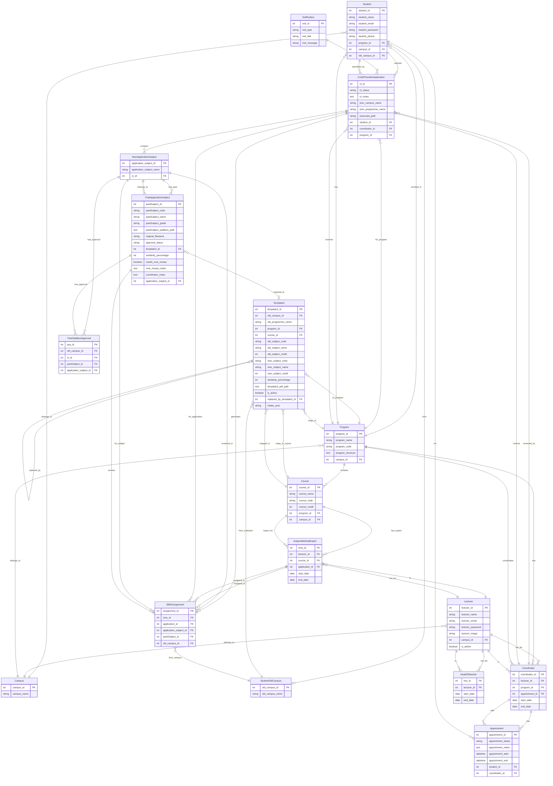

# Credit Transfer System - ERD Diagram

## Key Relationships Explained

### Template 3 Flow:
1. **Template3** stores pre-approved mappings from old institution programs to new institution courses
2. **PastApplicationSubject** can be matched to **Template3** (auto-approval)
3. If no Template3 match → **PastApplicationSubject.needs_sme_review = true**
4. **SMEAssignment** created for SME review
5. **SubjectMethodExpert** reviews and updates **PastApplicationSubject**

### Approval Status Flow:
- `pending` → Initial state
- `approved_template3` → Matched to Template3, auto-approved
- `needs_sme_review` → No Template3 match, sent to SME
- `approved_sme` → SME reviewed and approved (similarity ≥80%)
- `rejected` → SME reviewed and rejected (similarity <80%)

### Cohort Tracking:
- When old institution changes subject code:
  - Old **Template3** entry: `is_active = false`
  - New **Template3** entry: `replaced_by_template3_id` points to old entry
  - **PastApplicationSubject** with new code → `needs_sme_review = true`

