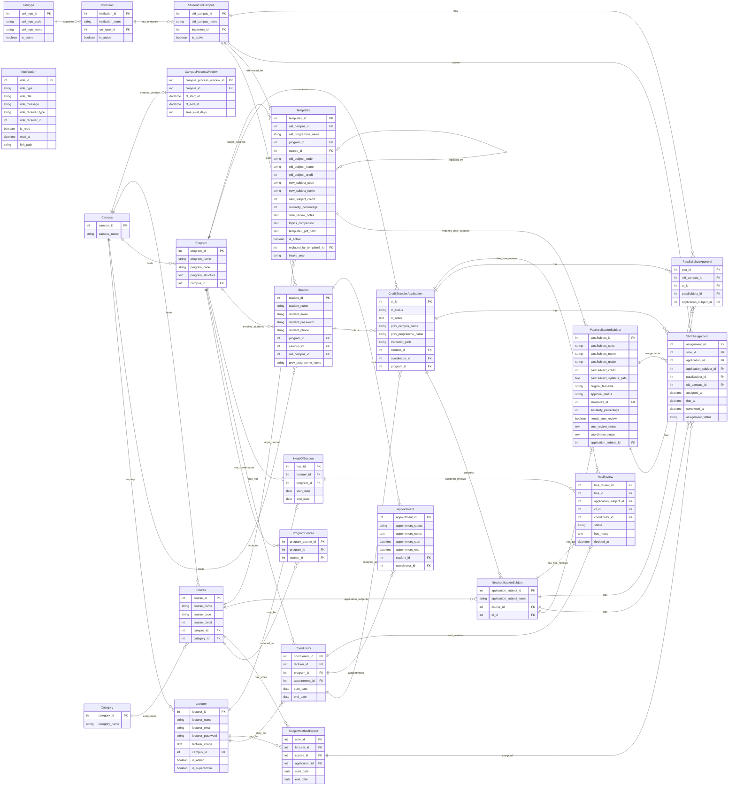

---
config:
  layout: elk
---

# Credit Transfer System — ERD (from Sequelize models)

```mermaid
erDiagram
    direction LR

    %% --- Previous institutions (not UniKL Campuses) ---
    UniType ||--o{ Institution : classifies
    Institution ||--o{ StudentOldCampus : has_branches

    %% --- UniKL structure ---
    Campus ||--o{ Lecturer : employs
    Campus ||--o{ Student : hosts
    Campus ||--o{ Program : hosts
    Campus ||--o{ Course : hosts
    Campus ||--o| CampusProcessWindow : process_window

    Category ||--o{ Course : categorizes

    Program ||--o{ ProgramCourse : includes
    Course ||--o{ ProgramCourse : included_in

    %% --- Lecturer roles ---
    Lecturer ||--o{ Coordinator : may_be
    Lecturer ||--o{ SubjectMethodExpert : may_be
    Lecturer ||--o{ HeadOfSection : may_be
    Program ||--o{ Coordinator : has_coordinators
    Course ||--o{ SubjectMethodExpert : has_smes
    Program ||--o{ HeadOfSection : has_hos

    %% --- Student & applications ---
    Student ||--o{ CreditTransferApplication : submits
    Student ||--o{ Appointment : books
    Program ||--o{ Student : enrolled_students
    StudentOldCampus ||--o{ Student : alumni

    Program ||--o{ CreditTransferApplication : receives
    Coordinator ||--o{ CreditTransferApplication : assigned_applications

    CreditTransferApplication ||--o{ NewApplicationSubject : contains
    CreditTransferApplication ||--o{ SMEAssignment : has
    CreditTransferApplication ||--o{ PastSyllabusApproval : has
    CreditTransferApplication ||--o{ HosReview : has_hos_reviews

    Course ||--o{ NewApplicationSubject : application_subjects
    NewApplicationSubject ||--o{ PastApplicationSubject : has_past
    NewApplicationSubject ||--o{ SMEAssignment : has
    NewApplicationSubject ||--o{ PastSyllabusApproval : has
    NewApplicationSubject ||--o{ HosReview : has_hos_reviews

    Template3 ||--o{ PastApplicationSubject : matched_past_subjects
    PastApplicationSubject ||--o{ PastSyllabusApproval : has
    PastApplicationSubject ||--o{ SMEAssignment : assignments

    StudentOldCampus ||--o{ Template3 : referenced_by
    StudentOldCampus ||--o{ SMEAssignment : context
    StudentOldCampus ||--o{ PastSyllabusApproval : has

    Program ||--o{ Template3 : target_program
    Course ||--o{ Template3 : target_course

    Template3 }o--o| Template3 : replaced_by

    SubjectMethodExpert ||--o{ SMEAssignment : assigned

    Coordinator ||--o{ Appointment : appointments

    %% --- HOS workflow ---
    HeadOfSection ||--o{ HosReview : assigned_reviews
    Coordinator ||--o{ HosReview : sent_reviews

    UniType {
        int uni_type_id PK
        string uni_type_code
        string uni_type_name
        boolean is_active
    }

    Institution {
        int institution_id PK
        string institution_name
        int uni_type_id FK
        boolean is_active
    }

    Campus {
        int campus_id PK
        string campus_name
    }

    Category {
        int category_id PK
        string category_name
    }

    Program {
        int program_id PK
        string program_name
        string program_code
        text program_structure
        int campus_id FK
    }

    Course {
        int course_id PK
        string course_name
        string course_code
        int course_credit
        int campus_id FK
        int category_id FK
    }

    ProgramCourse {
        int program_course_id PK
        int program_id FK
        int course_id FK
    }

    StudentOldCampus {
        int old_campus_id PK
        string old_campus_name
        int institution_id FK
        boolean is_active
    }

    Student {
        int student_id PK
        string student_name
        string student_email
        string student_password
        string student_phone
        int program_id FK
        int campus_id FK
        int old_campus_id FK
        string prev_programme_name
    }

    Lecturer {
        int lecturer_id PK
        string lecturer_name
        string lecturer_email
        string lecturer_password
        text lecturer_image
        int campus_id FK
        boolean is_admin
        boolean is_superadmin
    }

    Coordinator {
        int coordinator_id PK
        int lecturer_id FK
        int program_id FK
        int appointment_id FK
        date start_date
        date end_date
    }

    SubjectMethodExpert {
        int sme_id PK
        int lecturer_id FK
        int course_id FK
        int application_id FK
        date start_date
        date end_date
    }

    HeadOfSection {
        int hos_id PK
        int lecturer_id FK
        int program_id FK
        date start_date
        date end_date
    }

    HosReview {
        int hos_review_id PK
        int hos_id FK
        int application_subject_id FK
        int ct_id FK
        int coordinator_id FK
        string status
        text hos_notes
        datetime decided_at
    }

    CreditTransferApplication {
        int ct_id PK
        string ct_status
        text ct_notes
        string prev_campus_name
        string prev_programme_name
        string transcript_path
        int student_id FK
        int coordinator_id FK
        int program_id FK
    }

    NewApplicationSubject {
        int application_subject_id PK
        string application_subject_name
        int course_id FK
        int ct_id FK
    }

    PastApplicationSubject {
        int pastSubject_id PK
        string pastSubject_code
        string pastSubject_name
        string pastSubject_grade
        int pastSubject_credit
        text pastSubject_syllabus_path
        string original_filename
        string approval_status
        int template3_id FK
        int similarity_percentage
        boolean needs_sme_review
        text sme_review_notes
        text coordinator_notes
        int application_subject_id FK
    }

    Template3 {
        int template3_id PK
        int old_campus_id FK
        string old_programme_name
        int program_id FK
        int course_id FK
        string old_subject_code
        string old_subject_name
        int old_subject_credit
        string new_subject_code
        string new_subject_name
        int new_subject_credit
        int similarity_percentage
        text sme_review_notes
        text topics_comparison
        text template3_pdf_path
        boolean is_active
        int replaced_by_template3_id FK
        string intake_year
    }

    SMEAssignment {
        int assignment_id PK
        int sme_id FK
        int application_id FK
        int application_subject_id FK
        int pastSubject_id FK
        int old_campus_id FK
        datetime assigned_at
        datetime due_at
        datetime completed_at
        string assignment_status
    }

    PastSyllabusApproval {
        int psa_id PK
        int old_campus_id FK
        int ct_id FK
        int pastSubject_id FK
        int application_subject_id FK
    }

    CampusProcessWindow {
        int campus_process_window_id PK
        int campus_id FK
        datetime ct_start_at
        datetime ct_end_at
        int sme_eval_days
    }

    Appointment {
        int appointment_id PK
        string appointment_status
        text appointment_notes
        datetime appointment_start
        datetime appointment_end
        int student_id FK
        int coordinator_id FK
    }

    Notification {
        int noti_id PK
        string noti_type
        string noti_title
        string noti_message
        string noti_receiver_type
        int noti_receiver_id
        boolean is_read
        datetime read_at
        string link_path
    }
```

## Notes

- **`Notifications`**: no foreign keys in the model; not linked to `CreditTransferApplications` in schema.
- **`Categories.category_name`**: unique in the Sequelize model (`unique: true`).
- **`Coordinator.appointment_id`**: optional link to an `Appointments` row; coordinators also **have many** appointments via `Appointments.coordinator_id`.
- **`SubjectMethodExpert.application_id`**: optional FK to `CreditTransferApplications`.
- **`CreditTransferApplication.coordinator_id`**: FK to `Coordinators`, not to `Lecturers` directly.
